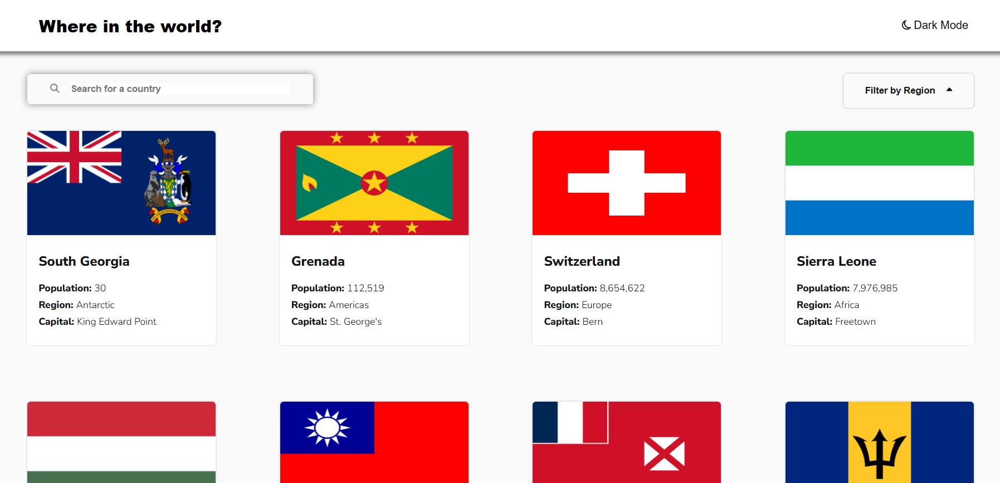
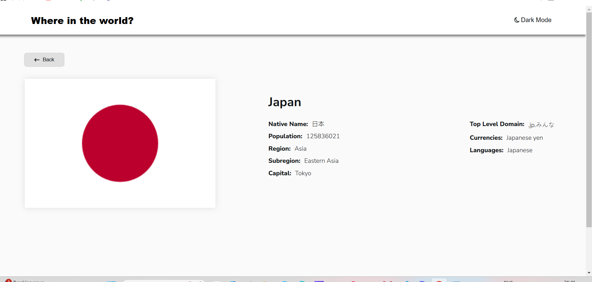
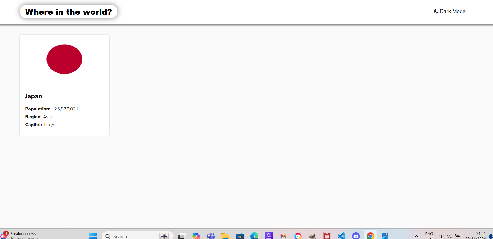
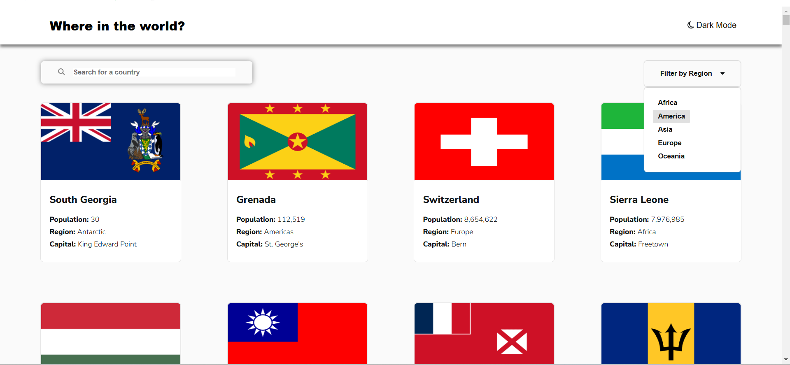
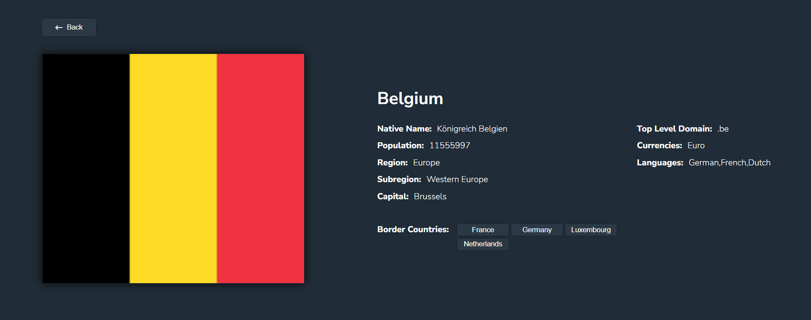
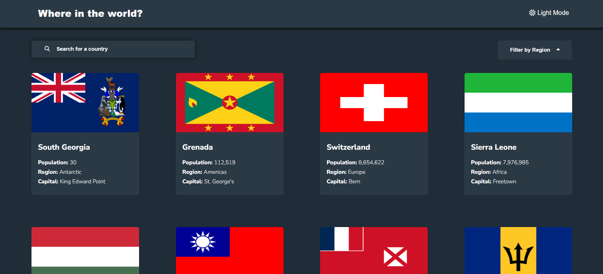
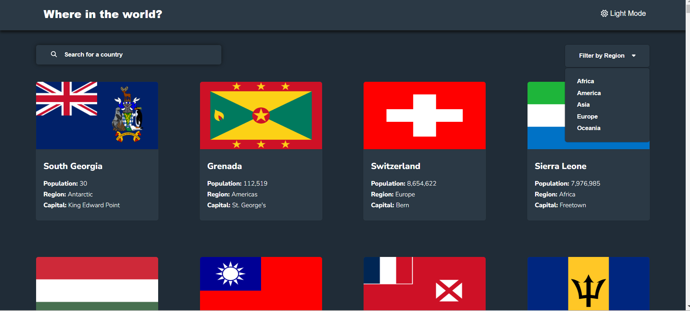
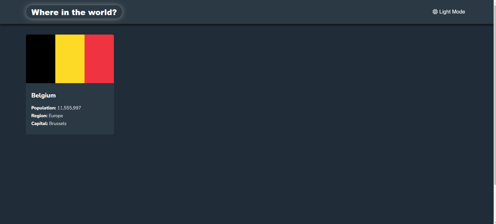
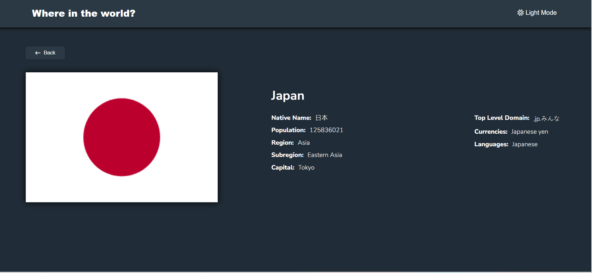

# Frontend Mentor - REST Countries API with color theme switcher solution

This is a solution to the [REST Countries API with color theme switcher challenge on Frontend Mentor](https://www.frontendmentor.io/challenges/rest-countries-api-with-color-theme-switcher-5cacc469fec04111f7b848ca). Frontend Mentor challenges help you improve your coding skills by building realistic projects.

## Table of contents

- [Overview](#overview)
- [The challenge](#the-challenge)
- [Screenshot](#screenshot)
- [Links](#links)
- [My process](#my-process)
- [Built with](#built-with)
- [Author](#author)

## Overview

### The challenge

Users should be able to:

- See all countries from the API on the homepage
- Search for a country using an `input` field
- Filter countries by region
- Click on a country to see more detailed information on a separate page
- Click through to the border countries on the detail page
- Toggle the color scheme between light and dark mode _(optional)_

### Screenshot

### Links

- Solution URL: [Add solution URL here](https://your-solution-url.com)
- Live Site URL: [Add live site URL here](https://tamar86.github.io/rest-countries-api-with-color-theme-switcher/)

## My process

### Built with

- [React](https://react.dev/) - JavaScript library for building user interfaces
- [Vite](https://vitejs.dev/) - Fast development build tool and bundler
- [React Router](https://reactrouter.com/) - Declarative routing for React
- [Context API](https://react.dev/learn/context) - For managing global state across the app
- [Font Awesome](https://fontawesome.com/) - Icons for enhancing the UI
- [ESLint](https://eslint.org/) - Linting tool for maintaining code quality
- [CSS Modules](https://github.com/css-modules/css-modules) - For locally scoped CSS styling
- **CSS Grid** - For building responsive grid-based layouts
- **Flexbox** - For flexible, responsive layouts
- **Media Queries** - For adapting the layout to different screen sizes

## Author

- Github - [Tamar Kikalishvili](https://github.com/Tamar86)
- Frontend Mentor - [@Tamar86](https://www.frontendmentor.io/profile/Tamar86)
